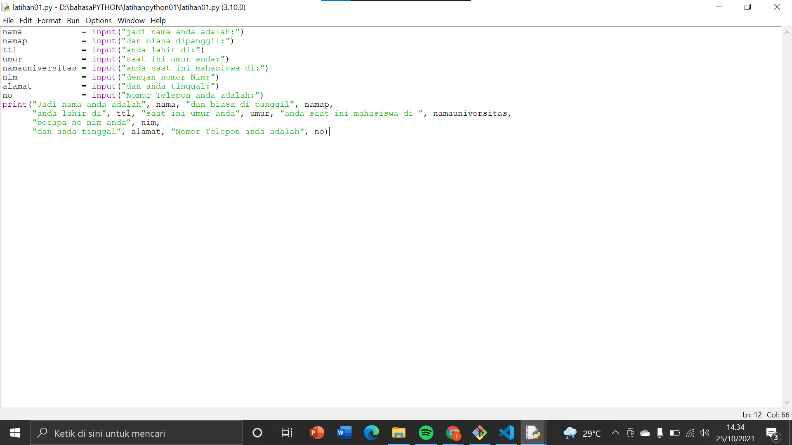
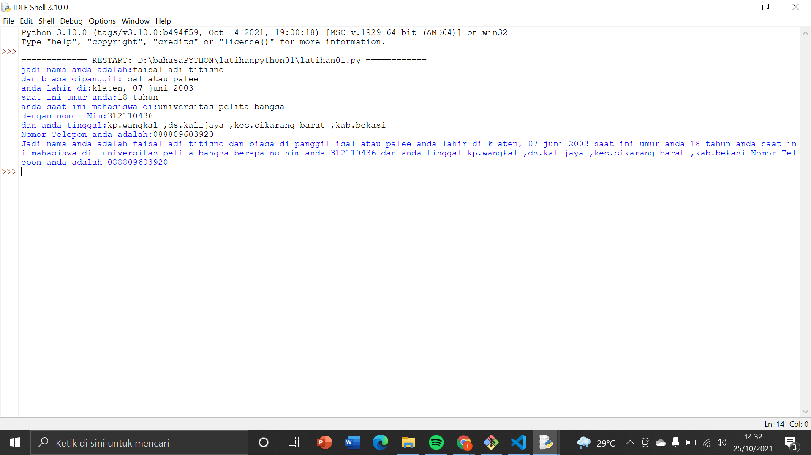

# Latihanpython01
## Latihan input dan output data pada python
### cara menginputnya

contoh : nama=input("siapa nama kamu:")

### cara mengoutput 

contoh: print("hello",nama,"umur kamu adalah",umur,"tahun")

## contoh gambar input dan output yang saya buat 
### input 

### output

